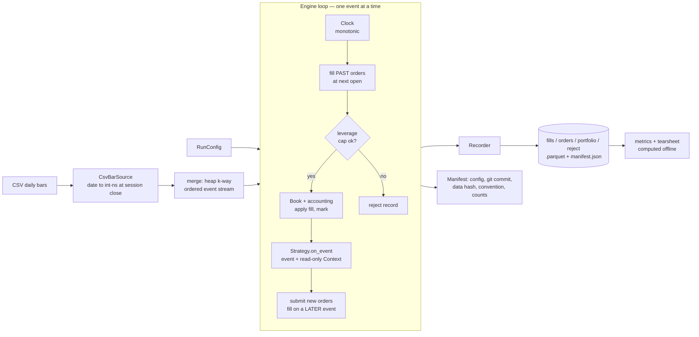

# Tessera

An event-driven backtesting engine for research on daily-bar strategies, built so that
**look-ahead is structurally impossible**, runs are **deterministic and reproducible**, and
every feature is an *addition* rather than a rewrite. Timestamped market events flow through an
ordered queue; a strategy reacts to **one event at a time** and emits orders; an execution model
decides fills; the engine writes every outcome to a record stream on disk; metrics and tearsheets
are computed **afterwards** from those records.

The design is organized around nine fixed interfaces ("seams"). The claim the project makes — and
tests — is not that its example strategies make money, but that **the instrument reads the market
correctly** and that its results are honest about transaction costs.

## Architecture



### The nine seams

1. **Everything is a timestamped event** — data flows as events through a queue, never a dataframe.
2. **Strategy never touches the data store** — it gets one event plus a read-only context.
3. **Strategies emit intent (`Order`), never outcomes** — no fill prices or PnL in strategy code.
4. **Execution is a swappable interface** — `FillModel` / `CostModel` protocols.
5. **Latency exists from day one, even at zero** — orders pass through a pending queue.
6. **The engine emits a stream, it does not return a result** — it pushes to a `Recorder`.
7. **A run is a `RunConfig` in, a `Manifest` out** — the engine knows nothing about where configs come from.
8. **Metrics are computed offline** from the record stream, never inside the engine.
9. **One clock, owned by the engine** — no wall clock, no unseeded randomness.

### What the design buys you

- **No look-ahead, structurally.** A strategy only ever receives `on_event(event, ctx)`; the
  context exposes present-time state (`ts`, `cash`, read-only `positions`) and has no channel to
  future data. History is the strategy's own rolling state. A test suite (`test_no_lookahead.py`)
  asserts that strategies which try to peek fail loudly.
- **Determinism.** The same config and seed produce an identical record stream
  (`test_determinism.py`); co-timestamped events have a total order so merges are reproducible.
- **Point-in-time timestamps.** Daily bars are stamped at the **16:00 ET session close** (converted
  to UTC, DST-correct), not midnight, so a daily bar can never sort ahead of that day's intraday
  ticks once an intraday source is added.
- **A risk floor.** The engine rejects any fill that would push gross exposure above
  `max_leverage × equity` (default 1×) — covering shorts, not just cash — and records the rejection.
- **Reproducibility you can check.** Each run writes a `manifest.json` (config, git commit, data
  content hash, timestamp convention, per-kind record counts). `tessera verify <run>` re-runs the
  config and confirms byte-identical output, and refuses — loudly — to compare across a timestamp
  convention change rather than silently producing a different result.

## Install & run

```bash
python3 -m venv .venv && . .venv/bin/activate
pip install -e ".[dev]"

# run a backtest -> prints a run directory under runs/
tessera run --strategy ma_crossover --symbol AAPL \
    --start 2005-01-03 --end 2024-12-31 --params fast=10,slow=50 --cost-bps 5

# metrics line + a 4-panel tearsheet PNG
tessera report runs/<the-printed-path>

# re-run the config and confirm identical output
tessera verify runs/<the-printed-path>
```

Strategies: `ma_crossover` (`fast`,`slow`) and `reversal`. Data: split/dividend-adjusted Stooq
daily bars for AAPL, MSFT, JPM, XOM, KO, NVDA (2005–2026) live in `data/` (gitignored).

## Results: a transaction-cost experiment

Two strategies over **20 years (2005-01-03 … 2024-12-31)**, six symbols, run **with and without a
5 bps per-trade cost**. Positions are sized to **10% of starting capital** (fixed-fractional
notional), so absolute return levels are small by design — the experiment is about *how costs
interact with turnover*, not about the level of return. Every number below comes from a single
run of the shipped code (24 runs, **0 rejections**).

### Momentum (`ma_crossover`, 10/50) — cost-**insensitive**

| symbol | total @0 bps | total @5 bps | cost drag | Sharpe @5 | ann. vol | max DD @5 | turnover | trades |
|--------|-------------:|-------------:|----------:|----------:|---------:|----------:|---------:|-------:|
| AAPL | 53.41% | 52.74% | −0.67 pp | 0.96 | 2.24% | −4.16% | 10.1x | 127 |
| MSFT | 26.01% | 25.35% | −0.66 pp | 0.64 | 1.78% | −3.30% | 11.8x | 129 |
| JPM  | 14.41% | 13.76% | −0.65 pp | 0.28 | 2.39% | −6.25% | 12.5x | 129 |
| XOM  |  6.90% |  6.21% | −0.69 pp | 0.17 | 1.86% | −5.21% | 13.9x | 138 |
| KO   |  4.02% |  3.27% | −0.75 pp | 0.14 | 1.23% | −3.80% | 14.8x | 150 |
| NVDA | 82.94% | 82.24% | −0.70 pp | 0.79 | 3.91% | −10.13% | 10.6x | 132 |

### Mean-reversion (`reversal`) — cost-**sensitive**

| symbol | total @0 bps | total @5 bps | cost drag | Sharpe @0 | Sharpe @5 | turnover @5 | trades |
|--------|-------------:|-------------:|----------:|----------:|----------:|------------:|-------:|
| AAPL | 21.91% | **−3.47%** | −25.4 pp | 0.35 | −0.04 | 515x | 5016 |
| MSFT | 24.36% | **−1.53%** | −25.9 pp | 0.45 | −0.01 | 547x | 4980 |
| JPM  | 34.06% |  7.96% | −26.1 pp | 0.51 | 0.14 | 448x | 5005 |
| XOM  | 31.14% |  5.53% | −25.6 pp | 0.62 | 0.12 | 477x | 5010 |
| KO   |  8.35% | **−16.90%** | −25.3 pp | 0.23 | −0.44 | 537x | 4973 |
| NVDA | 54.89% | 29.00% | −25.9 pp | 0.56 | 0.31 | 473x | 4994 |

### What the experiment shows

The two strategies carry a **~37× difference in cost sensitivity**, and it is entirely explained by
turnover. Momentum trades ~130 times in 20 years, so 5 bps costs it **under 0.75 pp** of total
return and it stays positive on all six symbols. Mean-reversion trades ~5,000 times, so the same
5 bps costs it **~25 pp** — enough to **flip AAPL, MSFT, and KO from positive to negative** and to
drive their Sharpe ratios through zero. The reversal edge that looks real at 0 bps is, on three of
six names, **an artifact of ignoring transaction costs**.

The lesson is methodological, and it is the reason the engine models costs and latency from day
one: a backtest that reports gross returns is not measuring a strategy, it is measuring its
turnover. (Turnover here is an *exposure* measure — roughly 20–27×/year for reversal across the six
symbols — not a cost proxy; cost is charged on notional, and the point is that high-turnover
notional accumulates cost that a gross-return backtest hides.)

## Validation

The engine is checked against ground truth computable **without** it (`test_validation.py`):

- **Buy-and-hold vs pandas.** A buy-and-hold run on each of the six symbols reproduces the total
  return, annualized return, annualized volatility, and max drawdown computed directly from the
  same bars in pandas — to **machine precision (0.0)**. The only permitted discrepancy from a naive
  first-close hold is that the entry fills at the next bar's *open*, and that residual is asserted
  to equal **exactly the first overnight gap**.
- **Analytic anchors.** A constant-daily-return series where buy-and-hold equity must equal
  `initial × (1+r)^k` at every bar, and a fixed round trip whose PnL is integer-exact.

Three load-bearing invariants have dedicated tests that are never weakened to make something pass:
no look-ahead, deterministic replay, and `cash + mark-to-market == equity` at every timestamp.
`pytest` runs 67 tests; `ruff` and `mypy --strict` (on `core` and `execution`) are clean.

## Honest limitations

Week-1 scope, deliberately not built speculatively: fills are naive (next open, fixed bps cost, no
slippage or market impact); data is daily bars only (no intraday, no order-book replay); half-day
early closes are not modeled by a market calendar; there is no walk-forward or purged
cross-validation yet. Each is a scheduled addition behind a seam, not a rewrite.

## One-line summary

> Built an event-driven backtesting engine with structurally enforced point-in-time data access,
> deterministic seeded replay, and manifest-based run reproducibility; benchmarked momentum and
> reversal strategies across 20 years of daily data to quantify transaction-cost sensitivity.
